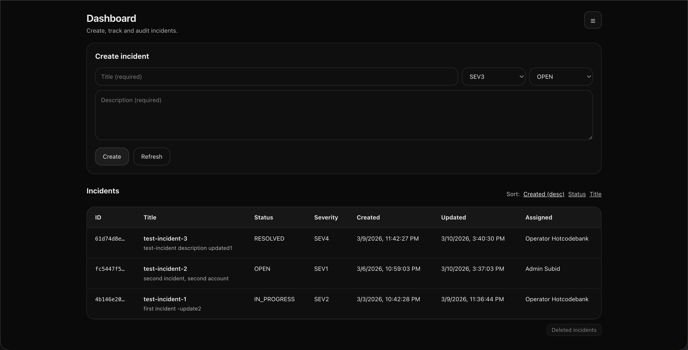
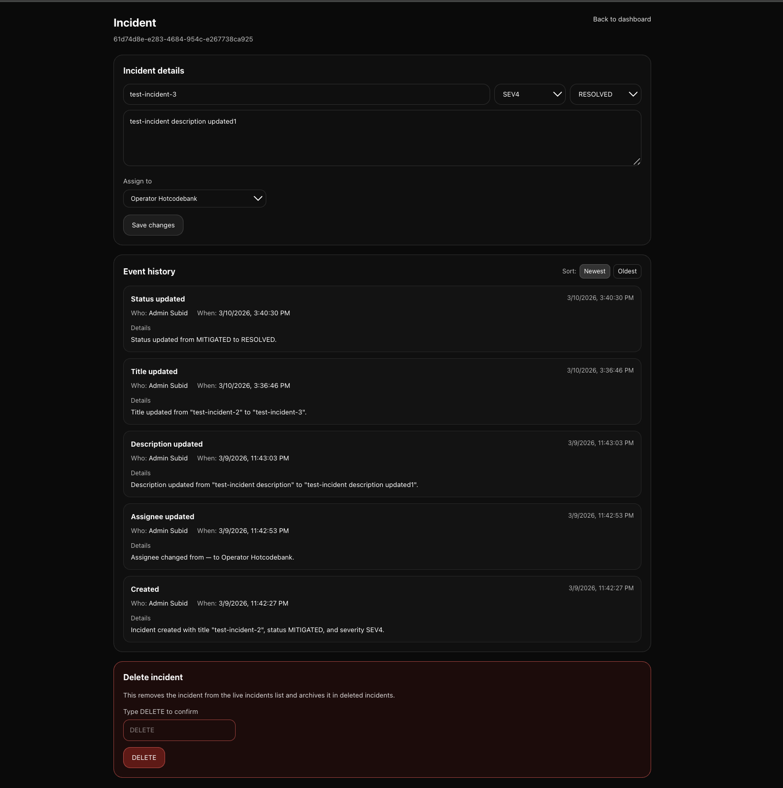
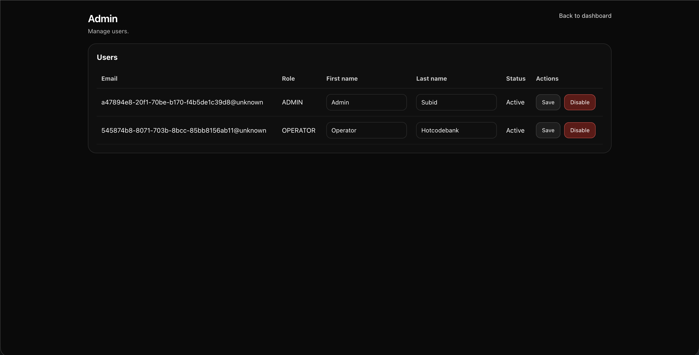
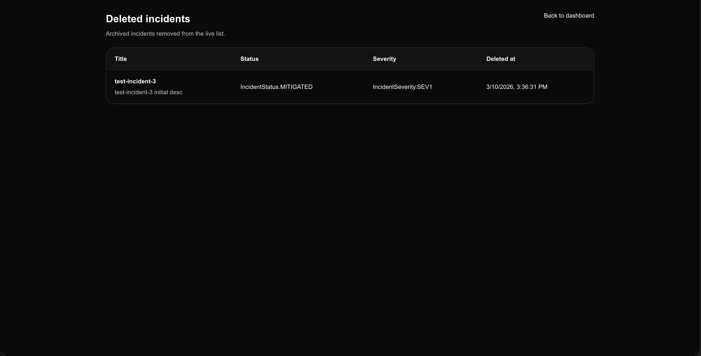

# Opsfluence

**Opsfluence** is an incident timeline platform for engineering teams.  
It helps teams **create, track, assign, update, audit, and archive incidents** with a structured event history that makes every operational change visible.

## Screenshots

### Dashboard
The dashboard provides incident creation, incident listing, assignment visibility, and sorting.

### Incident details and event history
Each incident has a structured event timeline showing who made changes, what changed, and when.

### Admin user management
Admins can manage users, edit first and last names, and disable accounts.

### Deleted incidents archive
Deleted incidents are removed from the live dashboard and retained in an archive for auditability.

## Why this project exists

During production incidents, important information gets scattered across tools, logs, dashboards, and human memory.

Opsfluence addresses that by modeling incidents as a timeline of structured events, making it easier to reconstruct what happened during an outage and understand who changed what, and when.

---

## Core features

- Incident creation and lifecycle management
- Structured event history for every incident change
- Role-aware access control
- Incident deletion with archive retention
- Admin-only user management
- Full audit trail for operational updates

---

## Architecture

**Frontend**
- Next.js 16
- TypeScript
- App Router
- authenticated API proxy routes

**Backend**
- FastAPI
- SQLAlchemy
- Pydantic
- Alembic

**Database**
- PostgreSQL

**Auth**
- Cognito-oriented authentication flow
- backend-enforced authorization and user disable checks

**Local infrastructure**
- Docker Compose

---

## Data model

Opsfluence is centered around a timeline-first incident model.

**Incident**  
Stores the current operational state of the incident.

**IncidentEvent**  
Stores each meaningful state transition, including actor, timestamp, type, and structured change details.

**DeletedIncident**  
Stores archived incidents after deletion so operational history is preserved.

---

## Engineering highlights

- Timeline-first incident modeling
- Structured audit history for mutable incident state
- Archived deletes instead of destructive deletes
- Backend-enforced ownership and admin permissions
- Admin-only user management
- Clear separation between authentication and app-level authorization

---

## Tech stack

- Next.js
- TypeScript
- FastAPI
- SQLAlchemy
- Alembic
- PostgreSQL
- Docker

---

## Status

**MVP 0 complete**

This version establishes the core incident timeline and audit model that future integrations and incident intelligence features can build on.